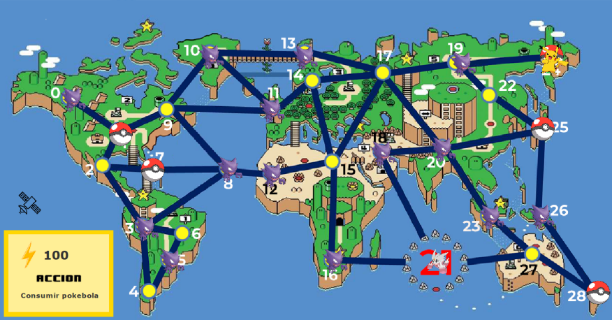

# Inteligencia artificial
## Trabajo práctico N1 - Búsqueda
> Grupo 2

Integrantes:
- [Albino, Sebastián](https://github.com/Sebastian-Albino)
- [Pacheco Pilan, Federico](https://github.com/FedericoPacheco)
- [Rodriguez, Alejandro](https://github.com/alerodriguez01)

---

### Resumen 
Como parte de la cátedra de Inteligencia Artificial de la carrera de Ingeniería en Sistemas de Información de la UTN FRSF se desarrolló un prototipo de agente basado en objetivos para resolver una versión modificada de juego *Pokemon Unite*. Este consistió de un agente pokemón dotado de cierta energía que estaba inmerso en un mapa con distintos lugares, pokebolas y adversarios. 

El objetivo del juego fue derrotar a todos los adversarios, incluyendo a un adversario maestro. La solución se implementó en el lenguaje de programación Java junto a un framework provisto por la cátedra,  [FAIA](https://code.google.com/archive/p/faia/). 
Se evaluó el funcionamiento con distintas estrategias de búsqueda (amplitud, profundidad, costo uniforme, avara) y se logró que el agente resuelva el problema para los casos en que su energía no es demasiado baja comparado con la cantidad de adversarios en el mapa.

### Ejecutar
Para correr el proyecto, debe ejecutarse el método **main** de la clase [*PokemonSearchMain*](./pokemon/src/PokemonSearchMain.java).
> - Si desea cambiar el método de búsqueda, puede hacerlo desde la clase [*PokemonAgent*](./pokemon/src/agent/PokemonAgent.java) en su método *selectAction()*.
> - Si desea cambiar al mapa reducido, puede hacerlo desde la clase [*Utilities*](./pokemon/src/utilities/Utilities.java)

### Resultados
En las pruebas realizadas, se observa que la estrategia de **búsqueda en profundidad** podría ser la más “económica” en términos de uso de memoria, puesto que se pudo ejecutar tanto para el mapa reducido como el completo. Para la estrategia de **búsqueda en  amplitud**, por la forma en que se expanden los nodos por niveles esto lleva a ocupar demasiada memoria y lo hace inviable para escenarios con muchas combinaciones posibles (por ejemplo, al usar el mapa completo). Para el caso de **búsqueda con costo uniforme** y **búsqueda avara** se ve que estos le “ahorran” acciones al agente, pudiendo éste llegar al objetivo más rápidamente. Aún así, no se las pudo aplicar para el mapa completo por el mismo problema de “explosión combinatoria” que experimenta amplitud.
